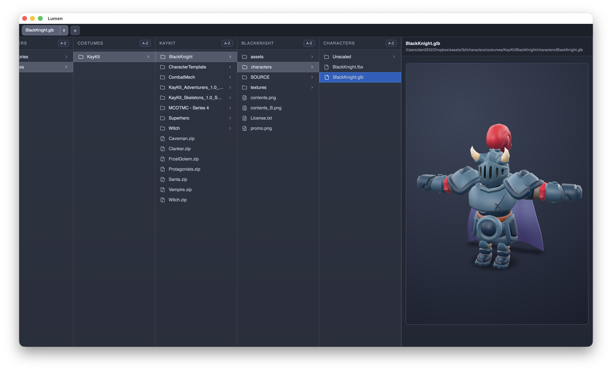
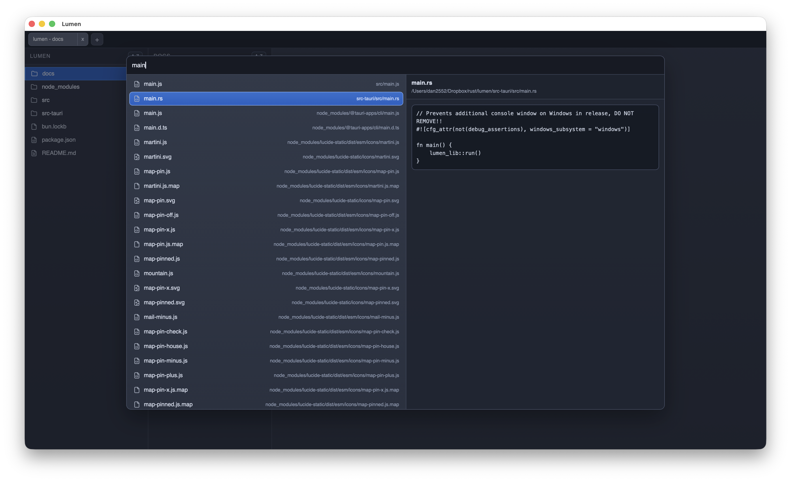

# Lumen

Lumen is a desktop file browser built with Tauri, with

* Finder-style multi-column navigation
* File previews
* Tabs
* Drag and drop support
* Text-editor-alike fuzzy file search
* A persistent state so you can pick up where you left off (stored in `~/.lumen/state.json`)
* Optional shell control bridge (`lumen-shell`) so Lumen can drive an interactive terminal shell




## Shell Bridge (CLI)

Lumen includes a companion CLI binary named `lumen-shell`.

- It runs your normal interactive shell on a PTY (readline/interactive programs work).
- It exposes a local unix socket that Lumen can send commands to (`cd`, `exec`, `ping`).

Run it from `src-tauri`:

```bash
cargo run --bin lumen-shell
```

You will see a banner like:

```text
Lumen shell control socket: /tmp/lumen-shell-12345.sock
```

In Lumen, open the command palette and run:

- `Shell: Connect control socket` and paste that socket path.

After it is connected, directory changes in Lumen will auto-send `cd` to the attached shell.

## Build And Run

### 1. Install prerequisites

- Rust (via [rustup](https://rustup.rs/))
- Tauri CLI:
  - `cargo install tauri-cli`

On macOS you should also have Xcode Command Line Tools installed:

- `xcode-select --install`

### 2. Development build

From the project root:

```bash
cargo tauri dev
```

### 3. Release build

From the project root:

```bash
cargo tauri build
```

Build outputs are generated under:

`src-tauri/target/release/bundle/`
